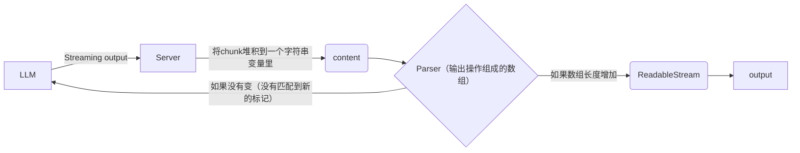

# DevLog 2025-06-04 - 关于EchoAI对于结构化数据的生成与更改

## 引子

你好呀，我是[@Acbox](https://github.com/sheepbox8646)

最近我们完成了EchoAI交互式白板的AI生成部分，这篇博客将会介绍我们对于交互可视化白板的具体生成流程，以及EchoAI交互白板的前世今生

如果还不知道EchoAI是什么，可以看[这里](/documentation/guides/about-echoai.md), EchoAI是一个带有可交互图形生成的学习搭子AI, 他可以根据学习需求生成对应的可交互图形，并在下一轮对话基于上一次图形进行修改。

我们使用[Sciux](https://github.com/sciux-kit/lib)作为EchoAI的底层框架，Sciux是我们针对教学场景设计的一套DSL语法, 结合了类似于Vue的响应式设计和许多教学相关的组件，他的语法类似于XML，我们针对AI做出了许多优化，使得AI可以更好的修改文档，我有一个小想法，将这套语法和渲染器应用到更多AI生成可交互图形的场景中，形成一个标准。

EchoAI的由来最早可以追溯到2022年，当时我受到[Manim](https://manim.community)的启发，准备仿照Manim在前端使用JavaScript实现一个动画引擎。

## Newcar

[Newcar](https://github.com/dromara/newcar)最开始是基于原声Canvas 2D的动画引擎，引入了坐标系，函数图像等组件，后来因为性能原因，我引入了CanvasKit作为渲染器。这个项目于2022年年底开始开发，2024年加入了[dromara](https://dromara.org)社区, 后来因为一些原因停止了维护

在newcar开发期间，我认识了[LobeChat](https://lobehub.com)的核心成员[@CanisMinor](https://github.com/canisminor1990)，他给我提了个建议，用AI根据需求去生成Newcar JavaScript代码并在网页上运行动画，所以我在2024年的七月份做出了NewcarAI的第一个原型

## VueMotion & MotionAI

[VueMotion](https://github.com/bug-duck/vuemotion)是一个基于Vue的动画引擎，他可以生成Vue的动画代码，并使用Vue的响应式系统与动画进行交互。Newcar在七月的时候，我想到了前端动画引擎相比于Manim最大的优势是，Manim最终产物是视频，而我们可以用元素来交互。但是因为Newcar采用的是canvas方案，而且没有响应式，所以我有了重写一个动画引擎的想法。于是，2024年8月，VueMotion诞生了。他也让我意识到，类似于现代前端框架的响应式设计很可能是AI与人进行图文交互的一个突破口。

用AI来生成基于VueMotion的Vue代码，并渲染到网页上，于是便有了MotionAI, 后来，我在10月到12月期间一直在做MotionAI的优化，但一次生成vue代码的缺陷太大了，MotionAI明显遇到了开发瓶颈。

## EchoAI和Eich

我在2025年1月被[SparkLab](https://sparklab.city)录取，这是一个类似于黑客松的创造营，中心活动是在2月初的8天做出一个产品原型。[@Seimo](https://github.com/seimodev)找到我说，正常ChatBot在解决数学题都只能输出文字，他想在文字的基础上在低下生成一个数学图形，于是我把我们的idea融合，便有了EchoAI的idea

我们一开始想的是生成json数据来画这些图形，但是json不够灵活，遇见大量需要类似于for循环生成的图形时，json就很难描述，于是我想着引入类似于vue的`v-for`等一些控制流，于是便有了[Eich](https://github.com/bijonai/eich)，一个和今天的Sciux很像的DSL，但是还是没能摆脱一次生成所有代码且无法基于此前图形修改的思维定式。

事实上当时市面上的一些竞品（比如Generative Manim，都是LLM一次性生成所有代码，然后用户在网页上运行，但是这样就很难修改。

我们在SparkLab的8天里基本确定了EchoAI的产品形态和以后可能的商业模式，后来团队人员经过了几次改动，目前也已经稳定下来。

Eich版本的EchoAI最初的基于前一次修改的方式是通过Function Calling, 通过数字索引和add-node等修改节点的工具，思路是比较不错的，但是后来这种方法的缺陷越来越明显，比如：

- 数字索引对于一些LLM来说很容易定位出错
- 工具调用一次只能进行一个操作
- 在工具调用的arguments里写代码，对LLM来说负担太大

## Sciux

我们在2025年3月开始设计[Sciux](https://github.com/sciux-kit/lib)这套DSL，并试图将他更好的与AI结合。

Sciux有组件系统，可以用来定义教学要用到的组件

Sciux有事件系统，可以用来定义交互

Sciux有动画系统，可以让交互和图形生成更加的丰富，吸引人

Sciux有响应式系统，可以让AI出题，并与用户交互

最重要的是，sciux不允许llm在script标签里像之前的MotionAI写vue代码那样写js，sciux只允许把js表达式写在参数里，如果写在script标签里会让文档的结构化大大减弱，这样就难以基于前一次进行修改。

比如sciux的变量定义

```html
<let :name="`${surname} ${lastName}`" :x="200" :y="x + 100">
```

所有的变量都是响应式的，如果AI想要出一道题目，我们也提供了一些交互表单

```html
<let :answer="2" :input :right="false" />
1 + 1 = <input model="input" />
<button @click="right = input === answer">Check</button>
<block #if="right">You are right!</block>
```

但工具调用和数字索引的缺陷还是存在，中间我们也有试过类似于Cursor的Fast Apply来修改前一次的代码，但是成本开销明显很大。后来我们使用XPath来代替数字索引去定位节点，并发明了一套“伪工具调用”的方法

## 伪工具调用

正常的工具调用前，如果在arguments里生成有逻辑性的代码，模型的性能和正确率会有所下降，于是我们发明了“伪工具调用”，通过一定的标记，在content里标记工具调用的内容，并在后端实时检查有没有完整标记，最后输出出去。

我们使用一堆双dollar符号来标记一个工具调用，如果中间有大量代码，则使用`start:`和`end:`来标记一个操作的开始和结束，并在提示词里让LLM按照这个标准输出。为了让代码的质量更好，我们让llm在进行每一个操作前先思考要怎么做，这是EchoAI Chalk工作流的提示词节选:

```markdown
1. ANSWER the question "According to the requirement, what components/animations/utils should I use?"
2. LIST the operations you need to do with the result from step 1.

step n: THINKING what should you do in this step
$$start:operation-name$$
Operation content here...
$$end:operation-name$$

Continue with the next step...
\`\`\`

## Content Operations (These are operations that should be included in your output content)

The following operations should be included in your output content when you need to modify the document:

- \`$$add-node position="XPath"$$\`: Add a new node to a parent node, add content included in slot.
\`\`\`example
$$start:add-node position="the xpath of the parent node"$$
<block>Hello World!</block>
$$end:add-node$$
\`\`\`
- \`$$set-prop position="XPath" prop="attr" value="value"$$
\`\`\`example
$$set-prop position="The xpath of the node" attr="attrName" value="112233"$$
\`\`\`
- \`$$remove-node position="XPath"$$
\`\`\`example
$$remove-node position="The xpath of the node"$$
\`\`\`
- \`$$set-content position="XPath"$$
\`\`\`example
$$start:set-content position="The xpath of the node"$$
<block>Hello World!</block>
$$end:set-content$$
\`\`\`
- \`$$remove-prop position="XPath" prop="attrName"$$
\`\`\`example
$$remove-prop position="The xpath of the node" prop="attrName"$$
\`\`\`
```

最后输出的内容类似于这样

```txt
// 这是普通的操作（删除节点）
$$delete-node position="/root"$$

// 这是中间有大量内容的操作 (添加节点)
$$start:add-node position="/root"$$
<content>...</content>
$$end$$
```

我们实现一个parser用于解析这个标记，如果遇到不完整的则跳过，最终输出一个由多个操作组成的数组。

```typescript
interface Range {
  start: number;
  end: number;
}

export function parse(text: string): Operation[] {
  const result: Operation[] = [];
  const excludedRanges: Range[] = [];

  // First handle start-end pairs
  const startEndPattern = /\$\$start:([a-zA-Z0-9-]+)([^$]*)\$\$(.*?)\$\$end:\1\$\$/gs;
  let startEndMatch;

  while ((startEndMatch = startEndPattern.exec(text)) !== null) {
    const [fullMatch, type, propsStr, content] = startEndMatch;
    const matchStart = startEndMatch.index;
    const matchEnd = matchStart + fullMatch.length;

    result.push({
      type: type as Operation['type'],
      ...(parseProps(propsStr) as any),
      content: content.trim()
    });

    // Mark this range as excluded for single tags
    excludedRanges.push({
      start: matchStart,
      end: matchEnd
    });
  }

  // Then handle single tags, excluding any start: or end: tags
  const singlePattern = /\$\$(?!start:)(?!end:)([a-zA-Z0-9-]+)([^$]*)\$\$/g;
  let singleMatch;

  while ((singleMatch = singlePattern.exec(text)) !== null) {
    const [fullMatch, type, propsStr] = singleMatch;
    const matchStart = singleMatch.index;
    const matchEnd = matchStart + fullMatch.length;

    // Skip if this tag is within any excluded range
    const isExcluded = excludedRanges.some(range =>
      matchStart >= range.start && matchEnd <= range.end
    );

    if (!isExcluded) {
      result.push({
        type: type as Operation['type'],
        ...(parseProps(propsStr) as any),
      });
    }
  }

  return result;
}

function parseProps(propsString: string): Record<string, string> {
  const props: Record<string, string> = {};
  const pattern = /(\w+)="([^"]*)"/g;

  let match;
  while ((match = pattern.exec(propsString)) !== null) {
    const [, key, value] = match;
    props[key] = value;
  }

  return props;
}
```

接下来就是在后端拦截LLM的流式输出并把内容暂存到一个字符串变量里:

```typescript
let content = ''
const latestResult = [] // 最新输出内容的parse解析后的所有操作
const response = model.chat.completions.create({
  messages: (...),
  stream: true
})
```

然后我们新建一个针对用户的stream, 如果result的长度有变，则增加一个针对用户端的chunk:

```typescript
return new ReadableStream({
  async start(controller) {
    try {
      for await (const chunk of response as any) {
        if (chunk.choices && chunk.choices[0]?.delta?.content) {
          content += chunk.choices[0].delta.content
          const operations = parse(content)
          if (operations.length > latestResult.length) { // 如果数组长度增加
            latestResult = operations
            results.push({
              ...operations[operations.length - 1],
              id: crypto.randomUUID() as string,
            })
            controller.enqueue(JSON.stringify({
              operations
            }))
          }
        }
      }
    } finally {
      callback?.(results)
      controller.close();
    }
  }
})
```

最后，我们在前端将这些操作一步一步的应用到图形上，并实时渲染，这样就实现了基于前一次的修改。



## 还有什么要做的

### 动画的优化

Sciux支持动画系统，可以用来定义动画

```html
<ele #animate="..."></ele>
<ele #animate.click="..."></ele>
```

动画语句解析函数的注释长这样：

```typescript
/**
 * Parse the source string into a group of animation
 * @example `ani,1000` => { name: 'ani', duration: 1000 }
 * @example `ani,1000,ease-in-out` => { name: 'ani', duration: 1000, easing: 'ease-in-out' }
 * @example `ani(param1,param2),1000,ease-in-out` => { name: 'ani', params: ['param1', 'param2'], duration: 1000, easing: 'ease-in-out' }
 * @example `ani1,1000 ani2,1000` => [{ name: 'ani1', duration: 1000 }, { name: 'ani2', duration: 1000 }]
 * @example `parallel(ani1,1000 ani2,1000) ani3,500` => [[{name: 'ani1', duration: 1000}, {name: 'ani2', duration: 1000}], {name: 'ani3', duration: 500}]
 * @param source The source string
 * @returns The parsed animation
 */
function resolve(source: string, easingResolver: (name: string) => Easing): AnimationParsedResult {
  // ...
}
```

我们希望给每一个组件加一个定制化的入场动画和出场动画，但是不由ai来控制，而是前端在进行添加操作时默认自动执行，以增强用户的观感冲击

AI也可以操作动画，比如在解决动点问题数学题中，如果第n步点P从某处移动到了另一处，AI可以操控它的移动。

本篇博客到此结束，谢谢大家！
